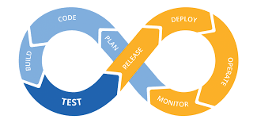

# Sully.AI QA Hackathon

## TEST PLAN

### Summary
Testing of the web application follows the "Practical Test Pyramid" approach, emphasizing unit testing at the base, with fewer integration and end-to-end (E2E) tests at higher levels. However, since this hackathon project does not provide application source code, unit and integration testing are out of scope. The primary goal is to establish a basic E2E test framework and write tests for common user workflows using Playwright and TypeScript.

### Assumptions
- The application is tested as a black box due to lack of access to internal code or APIs.
- Only one user account is available for testing; it is assumed to have all necessary permissions and no user-specific restrictions are tested.
- All tests are performed through the UI, as API and backend integration tests are not feasible.

### Manual Testing
#### Bug List
- When updating profile, the phone number field is not normalized, and the "type" dropdown is incorrectly located.
- Welcome message defaults to email address; after updating the profile name, it displays "Hello {Last Name}" instead of the full name.
- Inconsistent page layout when navigating between pages using the left sidebar navigation.

### Automated E2E Testing
- Playwright with TypeScript is used for E2E testing to align with the application's technology stack.
- The test framework uses the Page Object Model (POM) pattern for maintainability and scalability.
- Core test coverage includes:
  - Login/authentication flows
  - Basic navigation and sidebar functionality
  - Modal and popup visibility
  - Scribe functionality (e.g., starting visits, adding notes, microphone input)
- Tests are designed to be robust and resilient to UI changes, using accessible selectors and explicit waits where necessary.
- Test data is managed using fixtures and sample audio files for microphone-related features.

### Performance Testing
- Not included in this project, but recommended for future work. Should cover:
  - UI performance and load times
  - Model transcribing and translation speed
  - Backend API performance
  - Scalability and throughput

### Security Testing
- Not included in this project, but recommended for future work. Should cover:
  - Penetration testing
  - Authentication and authorization checks
  - Data privacy and input validation

## RELEASE PLAN

### Standard CI/CD Loop for Agile Software Development Lifecycle

*Figure: Example CI/CD pipeline for Agile SDLC.*

**Plan:** Requirements gathering and sprint planning  
**Code:** Feature implementation (design, architecture, unit testing)  
**Build:** Linting, code coverage gates, source code compilation, dockerization  
**Test:** Various manual/automated tests (functionality, integration, E2E, release)  
**Release:** Prep for release (notify any third party, create release notes)  
**Deploy:** Deploy code to servers (K8s container / VM / etc, canary or blue-green deploy)  
**Operate:** Ensure infrastructure configuration and stability  
**Monitor:** Monitor application performance and review any alerts

Since agile methodologies generally practice a shift-left mentality and encourage quick, consistent deployments, a twice-weekly deployment schedule is both practical and effective. High test coverage—especially through automated E2E tests—provides strong confidence in release quality.

**Common CI/CD and DevOps Tools that I use very frequently:**
- Jenkins (automation server for CI/CD pipelines)
- Docker (containerization and versioning)
- Kubernetes (K8s, for orchestration)
- Artifactory (artifact repository)
- JIRA (issue and project tracking and stakeholder communication)
