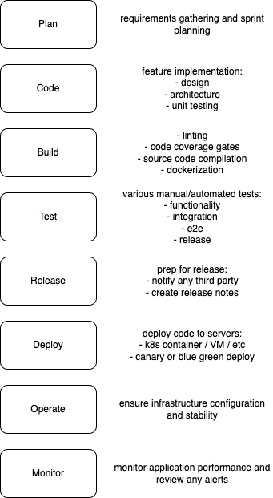

# sully_hackathon

## TEST PLAN

### Summary
Testing of the web application follows the "Practical Test Pyramid" approach, emphasizing unit testing at the base, with fewer integration and end-to-end (E2E) tests at higher levels. However, since this hackathon project does not provide application source code, unit and integration testing are out of scope. The primary goal is to establish a basic E2E test framework and write tests for common user workflows using Playwright and TypeScript.

### Assumptions
- The application is tested as a black box due to lack of access to internal code or APIs.
- Only one user account is available for testing; it is assumed to have all necessary permissions and no user-specific restrictions are tested.
- All tests are performed through the UI, as API and backend integration tests are not feasible.

### Manual Testing
#### Bug List
- When updating profile, the phone number field is not normalized, and the "type" dropdown is incorrectly located.
- Welcome message defaults to email address; after updating the profile name, it displays "Hello {Last Name}" instead of the full name.
- Inconsistent page layout when navigating between pages using the left sidebar navigation.

### Automated E2E Testing
- Playwright with TypeScript is used for E2E testing to align with the application's technology stack.
- The test framework uses the Page Object Model (POM) pattern for maintainability and scalability.
- Core test coverage includes:
  - Login/authentication flows
  - Basic navigation and sidebar functionality
  - Modal and popup visibility
  - Scribe functionality (e.g., starting visits, adding notes, microphone input)
- Tests are designed to be robust and resilient to UI changes, using accessible selectors and explicit waits where necessary.
- Test data is managed using fixtures and sample audio files for microphone-related features.

### Performance Testing
- Not included in this project, but recommended for future work. Should cover:
  - UI performance and load times
  - Model transcribing and translation speed
  - Backend API performance
  - Scalability and throughput

### Security Testing
- Not included in this project, but recommended for future work. Should cover:
  - Penetration testing
  - Authentication and authorization checks
  - Data privacy and input validation

## RELEASE PLAN
